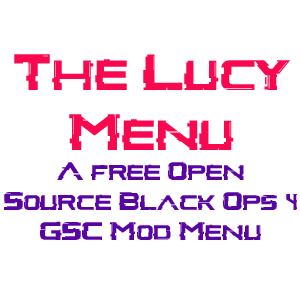

[![Contributors][contributors-shield]][contributors-url]
[![Forks][forks-shield]][forks-url]
[![Stars][stars-shield]][stars-url]
[![Issues][issues-shield]][issues-url]

<!-- PROJECT LOGO -->
 

  
  <h3 align="center">The Lucy Menu</h3>

  

	A Free, Open Source, Fully Maintained BO4 MP Menu Base Made in GSC.
     
    <a href="https://github.com/TheUnknownCod3r/BO4-Lucy-MP-Base/issues">Report Bug</a>
    ·
    <a href="https://github.com/TheUnknownCod3r/BO4-Lucy-MP-Base/issues">Request Feature</a>
  

<!-- TABLE OF CONTENTS -->

  
Table of Contents

  <ol>
    <li><a href="#prerequisites">Prerequisites</a></li>
    <li><a href="#usage">Usage</a></li>
    <li><a href="#roadmap">Roadmap</a></li>
    <li><a href="#contributing">Contributing</a></li>
	  <li><a href="#changelog">Changelog</a></li>
    <li><a href="#acknowledgments">Acknowledgments</a></li>
    <li><a href="#Mods Using This Base">Mods which use this base</a></li>
  </ol>

### Prerequisites

To use this Mod Menu, you must have Visual Studio Code, and T7 Compiler.
You can download T7 Compiler [Here](https://www.github.com/shiversoftdev/t7-compiler/releases/)
Visual Studio Code can be obtained [Here](https://code.visualstudio.com/)

(<a href="#top">back to top</a>)

<!-- USAGE EXAMPLES -->
## Usage
	To use The Mod Menu, The following instructions can be used with ease. 
	
	1. Download a copy of the Repository by clicking Code> Download Zip
	
	2. Load Visual Studio Code, Click File, Open Workspace, and load the Project.workspace in the BO4-Lucy-Menu Folder you downloaded
	
	3. Load Black Ops 4, Go into a Zombies private match Lobby, and Inject the Menu. Do NOT inject in a Pre game Lobby, You will crash.
	
	4. Once the game loads, You should be able to Aim and Knife to open the menu. 

(<a href="#top">back to top</a>)

<!-- ROADMAP -->
## Roadmap

(<a href="#top">back to top</a>)

<!-- CONTRIBUTING -->
## Contributing

Contributions by the community are welcome, as are Bug Fixes, and suggestions. If you have an idea You wanna make and add, here's how you can contribute!

1. Fork the Project
2. Create a new branch and in the name, add -add-yourchanges
3. Apply and test your changes
4. If no issues occur, Submit a Pull request, and we'll check everything before accepting!

(<a href="#top">back to top</a>)

## Changelog

Version 1.0

	

		Version 1.0
	

	- Source Code Publish!

<!-- ACKNOWLEDGMENTS -->
## Acknowledgments

This wouldn't be possible without the following people

* [Shiversoft Dev](https://www.github.com/shiversoftdev/T7-compiler)
	without T7 Compiler, BO4 GSC Injection wouldn't be possible.

* [G1llam](https://www.github.com/G1llam/)
	Original Menu creator

* [TheUnknownCod3r](https://www.github.com/TheUnknownCod3r/)
	Taking over updates, and Porting new features.
	

(<a href="#top">back to top</a>)

<!-- UsingTheMod -->
## Mods Using This

These are mods that are currently utilising this code base.

* [Phantom T8](https://github.com/Lurkzy/phantom-t8)
      Phantom T8, A BO4 Multiplayer Mod Menu

(<a href="#top">back to top</a>)

<!-- MARKDOWN LINKS & IMAGES -->
<!-- https://www.markdownguide.org/basic-syntax/#reference-style-links -->
[contributors-shield]: https://img.shields.io/github/contributors/TheUnknownCod3r/BO4-Lucy-MP-Base.svg?style=for-the-badge
[contributors-url]: https://github.com/TheUnknownCod3r/BO4-Lucy-MP-Base/graphs/contributors
[forks-shield]: https://img.shields.io/github/forks/TheUnknownCod3r/BO4-Lucy-MP-Base.svg?style=for-the-badge
[forks-url]: https://github.com/TheUnknownCod3r/BO4-Lucy-MP-Base/network/members
[stars-shield]: https://img.shields.io/github/stars/TheUnknownCod3r/BO4-Lucy-MP-Base.svg?style=for-the-badge
[stars-url]: https://github.com/TheUnknownCod3r/BBO4-Lucy-MP-Base/stargazers
[issues-shield]: https://img.shields.io/github/issues/TheUnknownCod3r/BO4-Lucy-MP-Base.svg?style=for-the-badge
[issues-url]: https://github.com/TheUnknownCod3r/BO4-Lucy-MP-Base/issues
[license-shield]: https://img.shields.io/github/license/TheUnknownCod3r/BO4-Lucy-MP-Base.svg?style=for-the-badge
[license-url]: https://github.com/TheUnknownCod3r/BO4-Lucy-MP-Base/blob/master/LICENSE.txt
